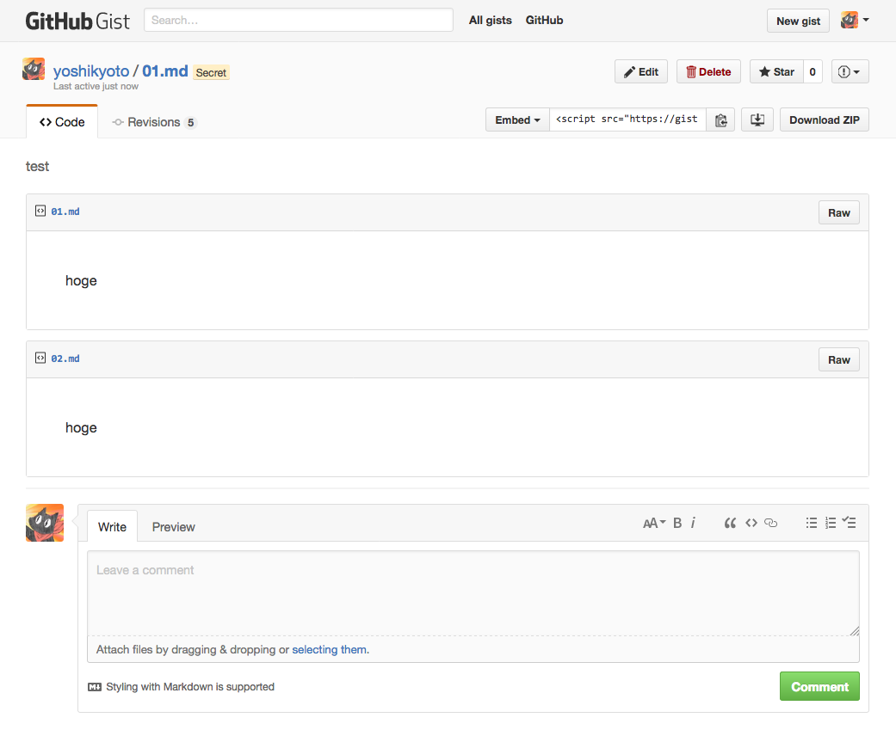
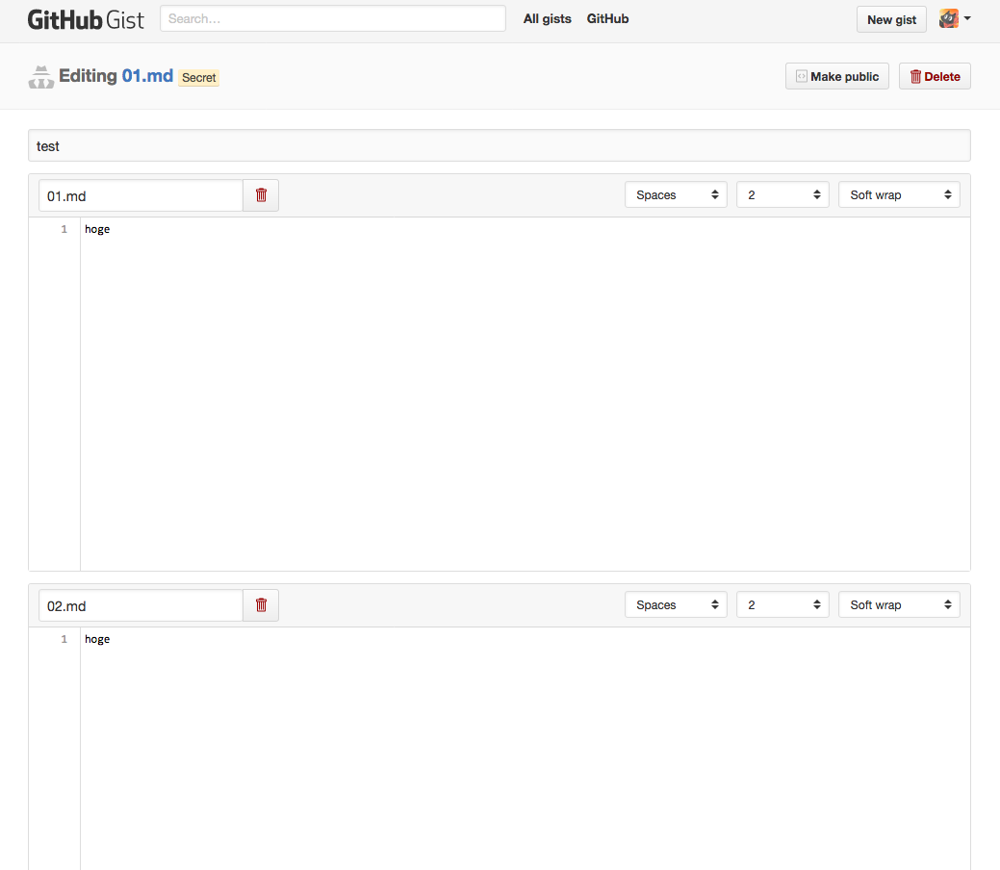
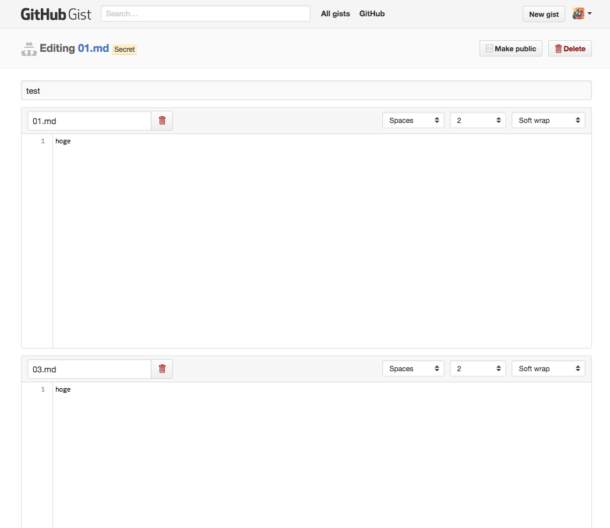
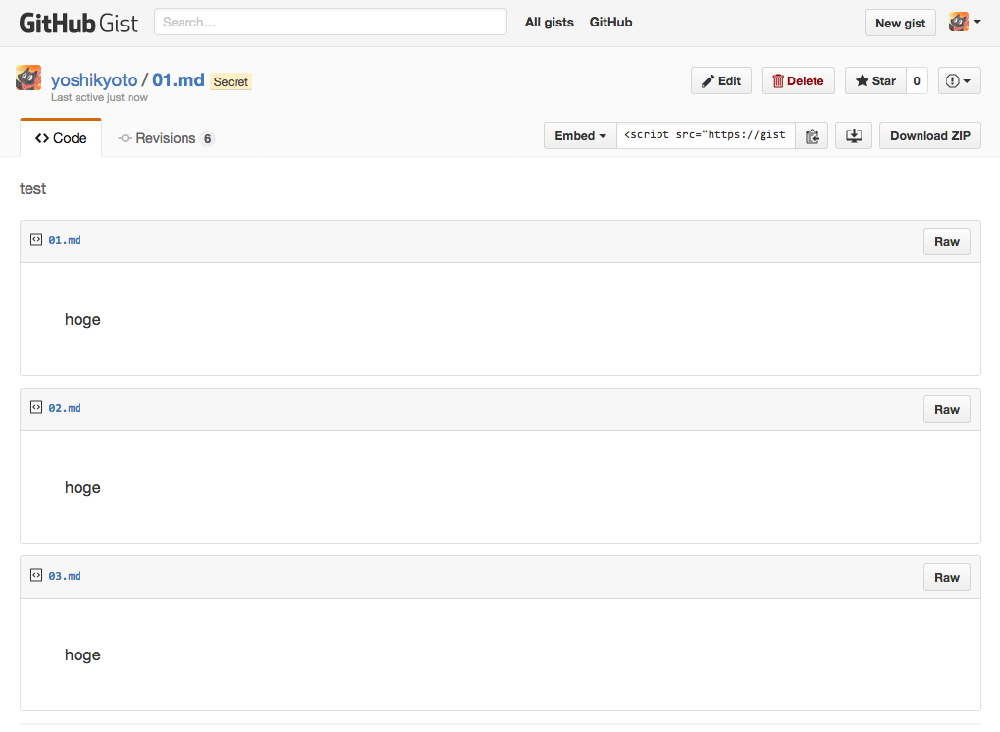

### I create secret gist with two files. For example 01.md and 02.md both of which have same text (body).

### Edit this gist.

### And rename 02.md into 03.md.

### I want to rename 02.md into 03.md, however there are three files 01.md, 02.md and 03.md.

